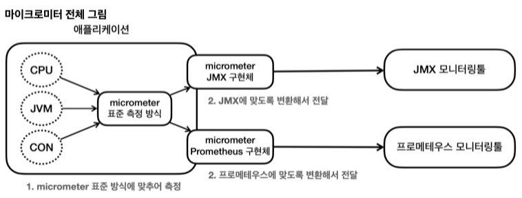
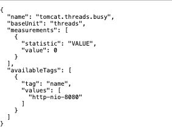

모니터링을 시각화 하기 위해 핀포인트, 그라파나 대시보드를 많이 사용하는데 
시스템의 다양한 정보를 이 모니터링 툴에 전달해서 사용해야 한다. 

예를 들어 CPU, JVM, 커넥션 정보 등을 JMX 툴에 전달한다면 각각의 정보를 JMX 모니터링 툴이 정한 포멧에 맞추어 측정하고 전달해야한다. 
하지만 이 때 모니터링 툴을 변경하게 되면 기존에 측정했던 코드까지 모두 변경해야하는 문제가 발생한다. 

이런 문제를 해결하는 것이 바로 마이크로미터라는 라이브러리이다. 

마이크로미터는 애플리케이션 메트릭 파사드라고 불리는데 애플리케이션의 메트릭을 마이크로미터가 정한 표준 방법으로 모아서 제공해준다. 
쉽게 얘기해서 마이크로미터가 추상화를 통해서 구현체를 쉽게 갈아 끼울 수 있도록 해두었다. 

로그를 추상화하는 SLF4J를 떠올려보면 쉽게 이해가 될 것이다. 
마이크로 미터가 지원하는 모니터링 툴을 아래 문서를 참고하자
https://micrometer.io/docs

스프링 부트 액츄에이터를 사용하면 수 많은 메트릭(지표)를 편리하게 사용할 수 있다. 이제 기본으로 제공하는 메트릭들을 확인해보자.

metrics 엔드포인트를 사용하면 기본으로 제공되는 메트릭들을 확인할 수 있다. http://localhost:8080/actuator/metrics

엔드포인트는 다음과 같은 패턴을 사용해서 더 자세히 확인할 수 있다.
http://localhost:8080/actuator/metrics/{name}

JVM 메모리 사용량을 확인해보자
http://localhost:8080/actuator/metrics/jvm.memory.used

Tag를 기반으로 정보를 필터링해서 확인할 수 있다. tag=KEY:VALUE 과 같은 형식을 사용해야 한다.
http://localhost:8080/actuator/metrics/jvm.memory.used?tag=area:heap

몇가지 예시를 더 살펴보자

HTTP 요청수를 확인
http://localhost:8080/actuator/metrics/http.server.requests

HTTP 요청수에서 일부 내용을 필터링 해서 확인해보자.
/log 요청만 필터  
http://localhost:8080/actuator/metrics/http.server.requests?tag=uri:/log


# 다양한 메트릭 
마이크로미터와 엑츄에이터가 기본으로 제공하는 다양한 메트릭을 확인해보자
JVM 메트릭 시스템 메트릭 애플리케이션 시작 메트릭 스프링 MVC 메트릭 톰캣 메트릭 데이터 소스 메트릭 로그 메트릭 기타 수 많은 메트릭이 있다.


### JVM 메트릭
JVM 관련 메트릭을 제공한다. jvm. 으로 시작한다.
메모리 및 버퍼 풀 세부 정보 가비지 수집 관련 통계 스레드 활용 로드 및 언로드된 클래스 수 JVM 버전 정보 JIT 컴파일 시간

### 시스템 메트릭
시스템 메트릭을 제공한다. system. , process. , disk. 으로 시작한다.
CPU 지표 파일 디스크립터 메트릭 가동 시간 메트릭 사용 가능한 디스크 공간

### 스프링 MVC 메트릭

스프링 MVC 컨트롤러가 처리하는 모든 요청을 다룬다. 메트릭 이름: http.server.requests

TAG 를 사용해서 다음 정보를 분류해서 확인할 수 있다.
uri : 요청 URI
method : GET , POST 같은 HTTP 메서드
status : 200 , 400 , 500 같은 HTTP Status 코드 
exception : 예외 outcome : 상태코드를 그룹으로 모아서 확인 1xx:INFORMATIONAL , 2xx:SUCCESS , 3xx:REDIRECTION , 4xx:CLIENT_ERROR , 5xx:SERVER_ERROR

### 데이터소스 메트릭

DataSource , 커넥션 풀에 관한 메트릭을 확인할 수 있다. jdbc.connections. 으로 시작한다.

최대 커넥션, 최소 커넥션, 활성 커넥션, 대기 커넥션 수 등을 확인할 수 있다.
히카리 커넥션 풀을 사용하면 hikaricp. 를 통해 히카리 커넥션 풀의 자세한 메트릭을 확인할 수 있다.

### 로그 메트릭

logback.events : logback 로그에 대한 메트릭을 확인할 수 있다.
trace , debug , info , warn , error 각각의 로그 레벨에 따른 로그 수를 확인할 수 있다. 예를 들어서 error 로그 수가 급격히 높아진다면 위험한 신호로 받아드릴 수 있다.

### 톰캣 메트릭
톰캣 메트릭은 tomcat. 으로 시작한다.
톰캣 메트릭을 모두 사용하려면 다음 옵션을 켜야한다. (옵션을 켜지 않으면 tomcat.session. 관련 정보만 노출된 다.)

```yaml

server:
  tomcat:
    mbeanregistry:
      enabled: true
```
톰캣의 최대 쓰레드, 사용 쓰레드 수를 포함한 다양한 메트릭을 확인할 수 있다.

